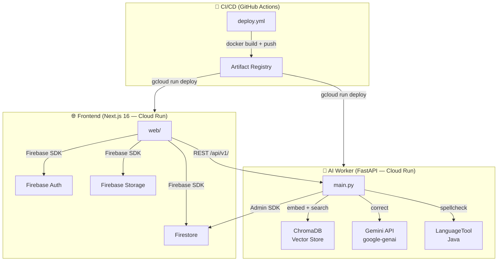

# CalíopeBot

> **Plataforma de corrección editorial potenciada por IA** — pipeline completo desde la subida de manuscritos hasta la exportación de datasets para fine-tuning de modelos de lenguaje.

[](https://github.com/tailorbotadmin/CaliopeBot/actions/workflows/deploy.yml)
[](https://github.com/tailorbotadmin/CaliopeBot/actions/workflows/ci.yml)

---

## ¿Qué es CalíopeBot?

CalíopeBot es una herramienta editorial SaaS multi-tenant que combina IA generativa (Gemini) con revisión humana experta ("human-in-the-loop") para corregir manuscritos en español según las normativas de la RAE y criterios editoriales propios de cada organización.

**Flujo principal:**
1. Un autor o editor **sube un manuscrito** (`.docx`) a su biblioteca.
2. El AI Worker lo procesa, aplica reglas RAE + criterios del tenant y genera **sugerencias de corrección** por fragmento.
3. El equipo editorial **acepta, edita o rechaza** cada sugerencia desde el editor dual-pane.
4. El responsable editorial **aprueba** el documento final y lo descarga como `.docx` corregido.
5. Cada decisión alimenta la base de datos de **entrenamiento**, exportable como dataset JSONL para fine-tuning de Gemini.

---

## Arquitectura



---

## Stack tecnológico

| Capa | Tecnología | Versión |
|---|---|---|
| Frontend | Next.js | 16.2 |
| Estilos | CSS Vanilla (design tokens) | — |
| Auth | Firebase Authentication | — |
| Base de datos | Firestore (multi-tenant) | — |
| Storage | Firebase Storage (CORS restringido) | — |
| AI Worker | FastAPI + Uvicorn | 0.128 / 0.39 |
| Modelo IA | Google Gemini (`google-genai`) | 1.47 |
| NLP español | LanguageTool (JRE) | 3.3 |
| Vector DB | ChromaDB | 1.5 |
| Contenedores | Docker multi-stage + Cloud Run | — |
| CI/CD | GitHub Actions + Workload Identity | — |

---

## Estructura del repositorio

```
CalíopeBot/
├── web/                          # Frontend Next.js
│   ├── src/app/
│   │   ├── page.tsx              # Login + recuperación de contraseña
│   │   └── dashboard/
│   │       ├── layout.tsx        # Sidebar + banner impersonación
│   │       ├── page.tsx          # KPIs + onboarding
│   │       ├── books/            # Biblioteca de manuscritos
│   │       ├── editor/           # Editor dual-pane de correcciones
│   │       ├── corrections/      # Vista de revisión por editor
│   │       ├── criteria/         # Gestión de reglas editoriales
│   │       ├── reports/          # KPIs + gráfico temporal
│   │       ├── training/         # Dataset de entrenamiento
│   │       ├── settings/         # Gestión de usuarios + impersonación
│   │       └── organizations/    # Panel SuperAdmin
│   ├── src/lib/
│   │   ├── auth-context.tsx      # Auth + impersonación de roles
│   │   ├── firebase.ts           # Configuración Firebase (env vars)
│   │   └── firestore.ts          # Helpers y tipos de datos
│   ├── Dockerfile                # Multi-stage, standalone output
│   ├── next.config.ts            # Security headers HTTP
│   └── create_user.mjs           # CLI para crear usuarios (Admin SDK)
│
├── ai-worker/                    # Backend FastAPI
│   ├── main.py                   # Todos los endpoints /api/v1/
│   ├── requirements.txt          # Versiones pinned (2026-04-15)
│   ├── Dockerfile                # Multi-stage con JRE para LanguageTool
│   └── scripts/
│       ├── create_org.py         # Crear/listar organizaciones en Firestore
│       ├── seed_rae_rules.py     # Poblar ChromaDB con 30+ reglas RAE canónicas
│       ├── seed_training_data.py # Insertar muestras de entrenamiento de ejemplo
│       ├── prepare_finetuning_dataset.py  # Generar JSONL desde .docx para Gemini SFT
│       ├── prepare_dataset.py    # Dataset formato simple {prompt, completion}
│       └── extract_rules_from_pairs.py    # Extraer reglas desde pares original/corregido
│
├── .github/workflows/
│   ├── deploy.yml                # Deploy ai-worker + web + CORS a Cloud Run
│   └── ci.yml                    # Lint + tests en PRs
│
├── cors.json                     # CORS Firebase Storage (aplicado en deploy)
└── firebase.json                 # Firebase Hosting → Cloud Run rewrite
```

---

## Requisitos previos

- **Node.js** ≥ 20
- **Python** ≥ 3.11
- **Docker** (para build local)
- **gcloud CLI** (para deploy manual)
- Proyecto **Firebase** con Firestore, Auth y Storage habilitados
- Proyecto **Google Cloud** con Cloud Run y Artifact Registry habilitados
- API key de **Gemini** (Google AI Studio o Vertex AI)

---

## Inicio rápido (local)

### 1. Frontend

```bash
cd web
cp .env.example .env.local   # rellenar variables NEXT_PUBLIC_FIREBASE_*
npm install
npm run dev                  # http://localhost:3000
```

### 2. AI Worker

```bash
cd ai-worker
cp .env.example .env         # rellenar GEMINI_API_KEY, FIREBASE_PROJECT_ID...
pip install -r requirements.txt
# Copiar service-account.json desde Firebase Console → Service Accounts
uvicorn main:app --reload    # http://localhost:8000
```

---

## Despliegue en producción (CI/CD)

El workflow `.github/workflows/deploy.yml` se activa en cada push a `main` y:

1. Autentica con GCP via **Workload Identity Federation** (sin claves estáticas).
2. Construye y publica las imágenes Docker en **Artifact Registry**.
3. Despliega `caliopebot-ai-worker` y `caliopebot-web` en **Cloud Run** (europe-west1).
4. Actualiza el **CORS de Firebase Storage** con `cors.json`.
5. Despliega el rewrite de **Firebase Hosting** → Cloud Run.

### Secrets necesarios en GitHub

| Secret | Descripción |
|---|---|
| `GCP_PROJECT_ID` | ID del proyecto de Google Cloud |
| `WIF_PROVIDER` | Workload Identity Federation provider |
| `WIF_SERVICE_ACCOUNT` | SA con permisos Cloud Run + Artifact Registry |
| `NEXT_PUBLIC_FIREBASE_API_KEY` | Firebase Web API Key |
| `NEXT_PUBLIC_FIREBASE_AUTH_DOMAIN` | `<project>.firebaseapp.com` |
| `NEXT_PUBLIC_FIREBASE_PROJECT_ID` | ID del proyecto Firebase |
| `NEXT_PUBLIC_FIREBASE_STORAGE_BUCKET` | Bucket de Storage |
| `NEXT_PUBLIC_FIREBASE_MESSAGING_SENDER_ID` | Sender ID |
| `NEXT_PUBLIC_FIREBASE_APP_ID` | App ID |
| `NEXT_PUBLIC_API_URL` | URL del AI Worker en Cloud Run |
| `FIREBASE_SERVICE_ACCOUNT` | JSON del service account (para firebase deploy) |

---

## Scripts de operaciones

Todos los scripts requieren `service-account.json` en `ai-worker/`.

```bash
cd ai-worker/scripts
```

| Script | Uso | Descripción |
|---|---|---|
| `create_org.py` | `python3 create_org.py --name "Editorial X"` | Crear organización (idempotente) |
| `create_org.py` | `python3 create_org.py --list` | Listar todas las orgs con IDs |
| `seed_rae_rules.py` | `python3 seed_rae_rules.py --org-id <id>` | Poblar ChromaDB con 30+ reglas RAE |
| `seed_training_data.py` | `python3 seed_training_data.py --org-id <id>` | Insertar muestras de entrenamiento |
| `prepare_finetuning_dataset.py` | `python3 prepare_finetuning_dataset.py --original docs/orig --corrected docs/corr` | Generar JSONL para Gemini SFT |

### CLI de usuarios

```bash
cd web
# Crear usuario con rol y organización
node create_user.mjs admin@org.com Secreto123 Admin <orgId>
node create_user.mjs super@tailorbot.tech Secreto123 SuperAdmin
```

---

## Onboarding de nueva organización (5 pasos)

1. **Crear la organización** en Firestore:
   ```bash
   python3 create_org.py --name "Editorial Anagrama"
   # → Copia el ID devuelto: abc123xyz
   ```

2. **Crear el usuario Admin**:
   ```bash
   node create_user.mjs admin@editorial.com Secreto123 Admin abc123xyz
   ```

3. **Cargar reglas RAE** (desde la UI o por script):
   - UI: iniciar sesión como SuperAdmin → Criterios Editoriales → "📚 Reglas RAE"
   - Script: `python3 seed_rae_rules.py --org-id abc123xyz`

4. **Crear usuarios adicionales** (editores, autores) desde la UI en Configuración o con `create_user.mjs`.

5. **Subir el primer manuscrito** desde Mis Manuscritos → el AI Worker lo procesará automáticamente.

---

## Seguridad

- **Custom Claims**: todos los permisos se gestionan via Firebase Auth custom claims (`role`, `organizationId`). Las reglas de Firestore validan estos claims en el servidor.
- **Impersonación**: los SuperAdmins pueden "ver como" cualquier usuario desde Configuración. Un banner naranja es visible en todo momento durante la impersonación.
- **CORS**: Firebase Storage solo acepta requests desde `https://caliope.tailorbot.tech` y `localhost`.
- **Security Headers**: la app Next.js envía CSP, X-Frame-Options, Referrer-Policy y Permissions-Policy en cada respuesta.
- **Credenciales**: ningún archivo del repositorio contiene credenciales hardcodeadas. Todos los scripts usan `service-account.json` (en `.gitignore`) o variables de entorno.
- **Dependencias**: `requirements.txt` tiene todas las versiones pinned para builds reproducibles.

---

## Roles del sistema

| Rol | Permisos |
|---|---|
| `SuperAdmin` | Acceso a todas las organizaciones, gestión global |
| `Admin` | Gestión completa de su organización (usuarios, criterios) |
| `Responsable_Editorial` | Criterios, reportes, aprobación final de documentos |
| `Editor` | Revisión y corrección de todos los manuscritos |
| `Autor` / `Traductor` | Solo sus propios manuscritos |

---

## Licencia

Propietario — © 2026 Tailorbot. Todos los derechos reservados.
